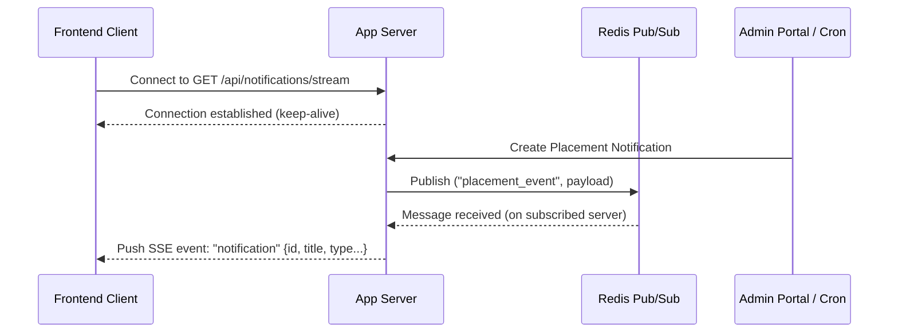

# Notification System Design

This document details the system design, API contracts, database architecture, scaling strategies, and query optimization for the Campus Notification Portal.

---

## Stage 1: API Design & Contract

To support the notification platform, we define a clear contract between the frontend and backend. The primary endpoints support fetching paginated notifications, filtering by category (Placement, Result, Event), marking individual notifications as read, and bulk marking notifications as read.

### 1. REST API Endpoints

#### A. Get Student Notifications
Retrieves a paginated list of notifications for the authenticated student, optionally filtered by notification type.

- **Endpoint**: `GET /api/notifications`
- **Headers**:
  ```http
  Authorization: Bearer <jwt_access_token>
  Accept: application/json
  ```
- **Query Parameters**:
  - `page` (integer, default: `1`): The current page number.
  - `limit` (integer, default: `10`): Number of notifications per page.
  - `type` (string, default: `All`): Filter by category. Allowed values: `All`, `Placement`, `Result`, `Event`.
- **Response (200 OK)**:
  ```json
  {
    "notifications": [
      {
        "id": 1,
        "title": "Google Placement Drive 2026",
        "message": "Google is hiring Software Engineering Interns. Apply by June 22nd.",
        "type": "Placement",
        "read": false,
        "createdAt": "2026-06-19T06:00:00.000Z"
      },
      {
        "id": 2,
        "title": "DBMS Course Grades Published",
        "message": "Grades for the Database Management Systems course have been uploaded.",
        "type": "Result",
        "read": true,
        "createdAt": "2026-06-18T12:00:00.000Z"
      }
    ],
    "pagination": {
      "total": 42,
      "totalPages": 5,
      "currentPage": 1,
      "limit": 10
    },
    "unreadCount": 5
  }
  ```

#### B. Mark Notification as Read
Marks a single notification as read.

- **Endpoint**: `POST /api/notifications/:id/read`
- **Headers**:
  ```http
  Authorization: Bearer <jwt_access_token>
  Content-Type: application/json
  ```
- **Response (200 OK)**:
  ```json
  {
    "success": true,
    "message": "Notification marked as read",
    "notificationId": 1,
    "unreadCount": 4
  }
  ```

#### C. Mark All Notifications as Read
Marks all unread notifications of the logged-in student as read.

- **Endpoint**: `POST /api/notifications/read-all`
- **Headers**:
  ```http
  Authorization: Bearer <jwt_access_token>
  Content-Type: application/json
  ```
- **Response (200 OK)**:
  ```json
  {
    "success": true,
    "message": "All notifications marked as read",
    "updatedCount": 5
  }
  ```

---

### 2. Real-Time Notification Delivery Mechanism

For immediate, low-latency delivery of notifications without polling, we use **Server-Sent Events (SSE)** or **WebSockets**. WebSockets are preferred if bidirectional communication is needed, but for a read-heavy notifications platform, **Server-Sent Events (SSE)** provides a lightweight, unidirectional alternative running natively over HTTP.

#### Real-Time Flow Design
1. **Client Connection**: When a student logs into the frontend, a persistent connection is opened to the `/api/notifications/stream` endpoint.
2. **Event Broker**: When an event occurs (e.g., a placement drive is announced), the backend service publishes an event to a Redis Pub/Sub channel.
3. **Distribution**: The streaming server (subscribed to Redis) intercepts the event and pushes it to the specific student's SSE connection.



---

## Stage 2: Database Design & Scaling

### 1. Database Choice: PostgreSQL
We suggest **PostgreSQL** for storing notifications.
- **Relational Integrity**: Notifications are inherently linked to core entities like `students` (users) and `placement_drives`/`courses` (sources). PostgreSQL maintains referential integrity (foreign keys) naturally.
- **Transactional Consistency (ACID)**: To display accurate unread counts across multiple devices, strict write/read consistency is required.
- **JSONB Support**: For custom notification metadata (e.g., clickable route parameters, custom icons), PostgreSQL's JSONB column types provide NoSQL-like flexibility with indexing capabilities.
- **Partitioning**: PostgreSQL natively supports declarative table partitioning, which is crucial as the data volume scales into millions of rows.

### 2. Database Schema (PostgreSQL)

```sql
-- Create Enum for Notification Types
CREATE TYPE notification_type AS ENUM ('Event', 'Result', 'Placement');

-- Students Table
CREATE TABLE students (
    id SERIAL PRIMARY KEY,
    name VARCHAR(100) NOT NULL,
    email VARCHAR(150) UNIQUE NOT NULL,
    roll_no VARCHAR(50) UNIQUE NOT NULL,
    created_at TIMESTAMP WITH TIME ZONE DEFAULT CURRENT_TIMESTAMP
);

-- Notifications Table
CREATE TABLE notifications (
    id BIGSERIAL PRIMARY KEY,
    student_id INTEGER NOT NULL REFERENCES students(id) ON DELETE CASCADE,
    title VARCHAR(150) NOT NULL,
    message TEXT NOT NULL,
    notification_type notification_type NOT NULL,
    is_read BOOLEAN NOT NULL DEFAULT FALSE,
    created_at TIMESTAMP WITH TIME ZONE DEFAULT CURRENT_TIMESTAMP
);

-- Optimization Indexes
CREATE INDEX idx_notifications_student_unread 
ON notifications(student_id, is_read, created_at DESC);
```

### 3. Scaling Challenges & Solutions (High Data Volume)

As data scales to tens of millions of notifications, the following challenges arise:

#### A. Query Degradation
- **Problem**: Indexes grow too large to fit in memory (RAM). Querying unread notifications starts requiring expensive disk reads.
- **Solution**: **Table Partitioning**. Partition the `notifications` table by month using PostgreSQL's range partitioning. Since students rarely read or scroll past recent notifications, only the current month's partition index needs to remain in RAM.

#### B. Index Overheads during Bulk Inserts
- **Problem**: Broad placement notifications (e.g., alert all 10,000 students of a placement drive) trigger 10,000 separate database writes, causing heavy indexing write contention.
- **Solution**: **Write Batching & Redis Caching**. Instead of writing 10,000 rows directly, write to a fast write-ahead log queue or use a bulk insert transaction. Also, store unread counts in Redis so that the database doesn't need to count rows on every page load.

---

### 4. Database Queries (PostgreSQL)

#### A. Fetch Paginated Notifications for Student (Stage 1 Endpoint)
```sql
SELECT id, title, message, notification_type, is_read, created_at
FROM notifications
WHERE student_id = :student_id
  AND (:type = 'All' OR notification_type = :type::notification_type)
ORDER BY created_at DESC
LIMIT :limit OFFSET :offset;
```

#### B. Mark Single Notification as Read
```sql
UPDATE notifications
SET is_read = TRUE
WHERE id = :id AND student_id = :student_id;
```

#### C. Mark All Notifications as Read for Student
```sql
UPDATE notifications
SET is_read = TRUE
WHERE student_id = :student_id AND is_read = FALSE;
```

---

## Stage 3: Query Optimization & Indexing Analysis

### 1. Analysis of the Query:
```sql
SELECT * FROM notifications
WHERE studentID = 1042 AND isRead = false
ORDER BY createdAt ASC;
```

#### Is the query accurate?
**Yes**, it correctly filters unread notifications for a specific student (`studentID = 1042`) and sorts them chronologically (`createdAt ASC`).

#### Why is this query slow?
At 5,000,000 rows, if no index is present, the database must perform a **Full Table Scan**, reading all 5,000,000 rows to find those matching `studentID = 1042` and `isRead = false`.
Even if there is a single index on `studentID`, the database has to fetch all matching notifications from disk, filter out those where `isRead` is true, and then perform an **External Merge Sort** to order them by `createdAt`.

#### What would you change and what is the computation cost?
We should add a **composite index** covering all three columns in the order of query filtering and sorting:
```sql
CREATE INDEX idx_notifications_student_unread_asc 
ON notifications(studentID, isRead, createdAt ASC);
```
- **Computation Cost Reduction**: 
  - Without Index: $O(N)$ where $N$ is the total number of notifications (5,000,000).
  - With Composite Index: $O(\log N + K)$ where $K$ is the number of unread notifications for that student (typically < 10). The database directly navigates the B-Tree index to locate the exact unread rows already sorted in chronological order. Query time drops from seconds to sub-milliseconds.

---

### 2. Critique: "Adding indexes on every column to be safe"

This advice is **highly counterproductive (anti-pattern)** for the following reasons:
1. **Write Overhead**: Every insert, update, or delete on the table forces the database to update every index associated with the modified column. This degrades write throughput dramatically.
2. **Disk and Memory Waste**: Each index takes up disk space. Since index pages are loaded into RAM to speed up searches, unnecessary indexes crowd out the database cache, leaving less room for active indexes and data.
3. **Plan Ineffectiveness**: The query planner can generally use only one index per table access for a given query. Adding individual indexes on `studentID`, `isRead`, and `createdAt` separately does not help a query that filters on both and sorts on the third.

---

### 3. Query: Students with a placement notification in the last 7 days

```sql
SELECT DISTINCT studentID
FROM notifications
WHERE notificationType = 'Placement'
  AND createdAt >= NOW() - INTERVAL '7 days';
```
*(Note: To make this query highly performant, a composite index on `(notificationType, createdAt)` is recommended.)*

---

## Stage 4: Database Performance & Caching

To solve the database bottleneck caused by students fetching notifications on every page load:

### 1. Strategies & Performance Optimizations

#### A. Redis Caching (Cache-Aside Pattern)
Store a student's recent notifications and unread counts in Redis.
- **How it works**: On page load, the application checks Redis first. If found, returns immediately. If a cache miss occurs, it queries PostgreSQL, populates Redis, and returns.
- **Tradeoffs**:
  - *Pros*: Extremely low read latency (sub-millisecond) and shields the primary database from read traffic.
  - *Cons*: Cache invalidation complexity. When a new notification is created, the cache for that student must be invalidated or updated.

#### B. Connection Pooling (PgBouncer)
Utilize a lightweight connection pooler to manage database connections.
- **How it works**: Share a small pool of physical database connections among thousands of client connections.
- **Tradeoffs**:
  - *Pros*: Prevents the database from hitting connection limits and reduces memory overhead.
  - *Cons*: Slight routing latency overhead, though negligible.

#### C. Read Replicas
Deploy read-only replicas of the database and direct all GET queries to them.
- **How it works**: Primary database handles write traffic (inserts/updates). Replicas replicate data asynchronously and handle all notification fetches.
- **Tradeoffs**:
  - *Pros*: Scales read capacity horizontally.
  - *Cons*: Replication lag. A student might not see a newly generated notification for a fraction of a second.

---

## Stage 5: Scaling Bulk Operations

### 1. Shortcomings of the Initial Loop
- **Synchronous Execution**: Running a loop over 50,000 students and calling third-party email APIs synchronously is blocking. If one email call takes 100ms, the entire process takes 1.4 hours.
- **Lack of Fault Tolerance**: If the script crashes or the email API fails midway (e.g., at student 200), the execution stops, leaving the remaining 49,800 students without notifications.
- **No Transaction Isolation**: Mixing database operations with network calls (`send_email`) inside the same loop can hold open database connections and cause lock contention.

### 2. Reliable & Fast Redesign
- **Decouple Database and Email**: Writing to the database is extremely fast. Sending emails is slow and unreliable. These processes must happen independently.
- **Message Queue Broker**: Publish the bulk notification job to a message queue (e.g., RabbitMQ or Redis/BullMQ).
- **Worker Workers**: Background worker processes consume tasks from the queue in parallel, chunking the 50,000 operations into small batches.
- **Retry Mechanism**: If sending an email fails for a specific student, the worker retries only that specific task with exponential backoff.

### 3. Revised Pseudocode (Message Queue Worker)

```javascript
// Publisher (HTTP Request Handler)
async function triggerBulkNotification(notificationData) {
  const job = {
    title: notificationData.title,
    message: notificationData.message,
    type: notificationData.type
  };
  await notificationQueue.add("bulk-notify", job);
}

// Queue Consumer (Background Worker)
async function processBulkNotificationJob(job) {
  const { title, message, type } = job.data;
  
  // 1. Fetch all student IDs (fast index read)
  const studentIds = await db.select("id").from("students");
  
  // 2. Insert notifications to DB in a single bulk transaction
  const dbRecords = studentIds.map(id => ({
    student_id: id,
    title,
    message,
    notification_type: type,
    is_read: false
  }));
  await db.batchInsert("notifications", dbRecords, 1000);
  
  // 3. Queue individual email tasks to be processed concurrently
  const emailJobs = studentIds.map(id => ({
    name: "send-student-email",
    data: { studentId: id, message }
  }));
  await emailQueue.addBulk(emailJobs);
  
  // 4. Broadcast real-time websocket/SSE alert
  await redis.publish("realtime-notifications", JSON.stringify({ title, type }));
}
```

---

## Stage 6: Priority Inbox Implementation

### 1. Priority Sorting Strategy
Priority is calculated using:
- **Weight**: Placement (3) > Result (2) > Event (1).
- **Recency**: Chronological sort descending based on the timestamp.

### 2. Maintaining the Top 10 Efficiently
To maintain the top 10 notifications dynamically in memory without resorting the entire array upon every new arrival:
- **Approach**: Use a **Min-Heap (Priority Queue)** of size 10.
- **Complexity**: 
  - Inserting a new notification into a heap of size 10 takes $O(\log 10) \approx O(1)$ constant time.
  - When a new notification arrives:
    1. If the heap contains fewer than 10 items, push the new item.
    2. If the heap contains 10 items, compare the new notification's priority with the root (which represents the lowest priority in the current top 10).
    3. If the new item has a higher priority than the root, pop the root and push the new item.
    4. Otherwise, discard it.
- This avoids sorting the entire list of $N$ notifications, which would take $O(N \log N)$ time.

